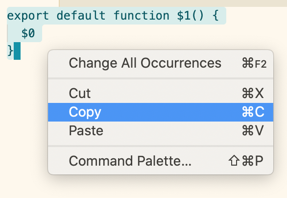
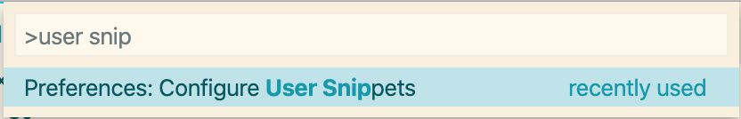
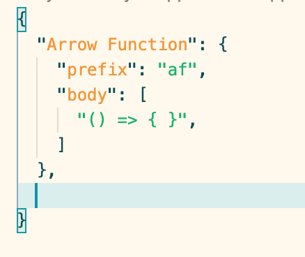
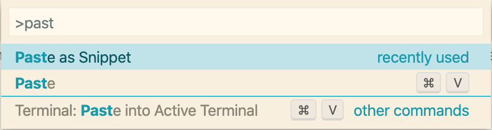
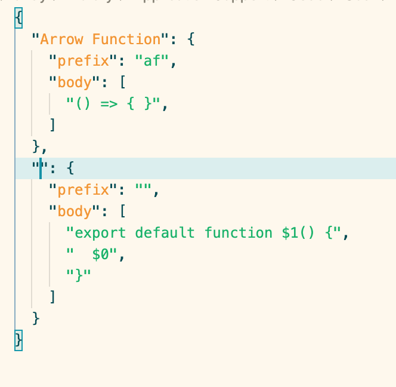

# paste-as-snippet

[](https://circleci.com/gh/vscodeshift/paste-as-snippet)
[](https://codecov.io/gh/vscodeshift/paste-as-snippet)
[](https://github.com/semantic-release/semantic-release)
[](http://commitizen.github.io/cz-cli/)
[](https://marketplace.visualstudio.com/items?itemName=vscodeshift.paste-as-snippet)

paste the clipboard into a VSCode snippets file

# Usage

## Copy some text from anywhere



## Go to a snippets file



## Position the cursor



## Run the **Paste as Snippet** command ✨



## Result

# 

[](https://marketplace.visualstudio.com/items?itemName=jedwards1211.vscode-extension-skeleton)

my personal skeleton for a VSCode extension

## Quick start

```sh
npx 0-60 clone https://github.com/jedwards1211/vscode-extension-skeleton.git
```

## Tools used

- babel 7
- typescript
- mocha
- chai
- istanbul
- nyc
- eslint
- prettier
- husky
- semantic-release
- renovate
- Circle CI
- Codecov.io
  > > > > > > > 039abc4e668034d58ba8149ff0ca14179e10b884
